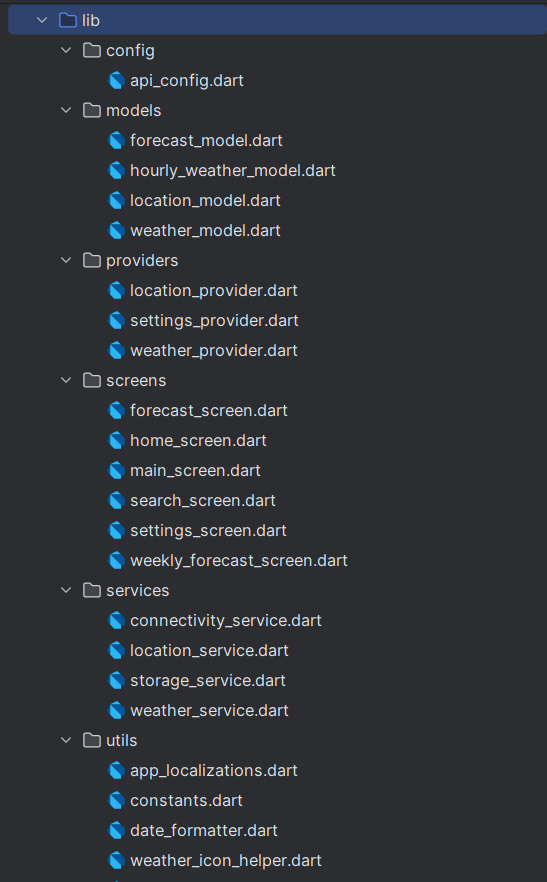
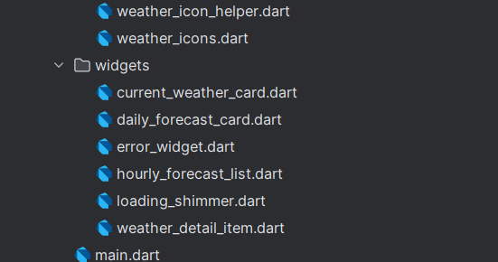

#  Flutter Weather App - Lê Trường Trường Huy

---

##  Giới thiệu
Ứng dụng **Flutter Weather App** là một ứng dụng di động giúp người dùng tra cứu thông tin thời tiết theo vị trí hoặc tìm kiếm thành phố bất kỳ.

Ứng dụng cung cấp:
- Thời tiết hiện tại
- Dự báo thời tiết nhiều ngày
- Giao diện thay đổi theo điều kiện thời tiết (trời nắng, mưa, ban đêm,...)

---

##  Tính năng chính
-  Lấy vị trí hiện tại của người dùng
-  Tìm kiếm thời tiết theo tên thành phố
-  Hiển thị thời tiết hiện tại:
  - Nhiệt độ
  - Độ ẩm
  - Tốc độ gió
  - Trạng thái thời tiết
-  Dự báo thời tiết (forecast)
-  Hỗ trợ giao diện ngày/đêm
-  Xử lý lỗi (không có mạng, sai tên thành phố,...)
-  Hiển thị loading khi đang tải dữ liệu

---

##  Hướng dẫn cấu hình API (KHÔNG để lộ key)

Ứng dụng sử dụng API thời tiết (ví dụ: OpenWeatherMap)

### Bước 1: Đăng ký API
- Truy cập: https://openweathermap.org/api
- Tạo tài khoản và lấy API Key

### Bước 2: Cấu hình trong project

**KHÔNG commit API key lên GitHub**

Tạo file:
```
lib/config/api_key.dart
```

Nội dung:
```dart
class ApiKey {
  static const String weatherApiKey = "YOUR_API_KEY_HERE";
}
```

Sau đó import:
```dart
import 'config/api_key.dart';
```

---

##  Screenshots


###  Thời tiết mưa


###  Thời tiết nhiều mây


###  Màn hình tìm kiếm


###  Màn hình dự báo


###  Trạng thái lỗi


###  Trạng thái loading


###  Trạng thái Offline

---

##  Cách chạy project

### 1. Clone project
```bash
git clone https://github.com/TruongHuy9/flutter_weather_app_letruongtruonghuy.git
```

### 2. Cài dependencies
```bash
flutter pub get
```

### 3. Chạy ứng dụng
```bash
flutter run
```

---

##  Công nghệ sử dụng
- Flutter (Dart)
- Provider (State Management)
- REST API
- HTTP package
- Geolocator (lấy vị trí)
- Intl (format ngày giờ)

---

##  Hạn chế
- Phụ thuộc vào API bên thứ 3
- Chưa tối ưu UI cho tablet
- Cần internet để hoạt động
- Độ chính xác phụ thuộc API

---

##  Hướng phát triển
-  Thêm lưu danh sách thành phố yêu thích
-  Hỗ trợ đa ngôn ngữ
-  Biểu đồ thời tiết
-  Thông báo thời tiết
-  Tùy chỉnh giao diện (theme)

---

##  Cấu trúc thư mục



---
